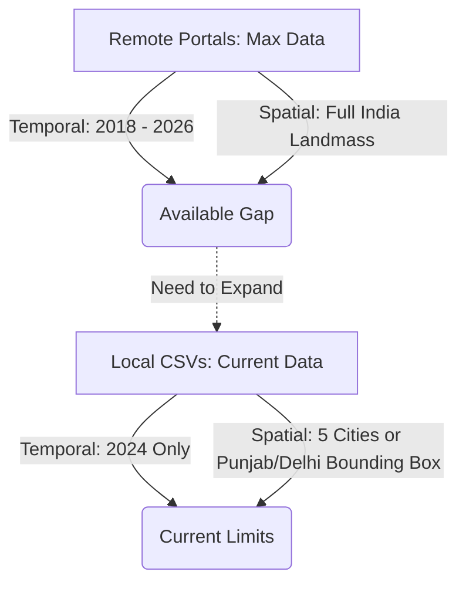

# Data Source Comparison & Gap Analysis Report

This report presents a comparative audit of the local CSV datasets currently uploaded in the workspace against the maximum possible data available from the official portals (Google Earth Engine, NASA FIRMS, Copernicus CDS, and CPCB).

---

## 1. Local CSV Datasets Audit

Our Python-based inspection of the files in `Input Documents/` reveals the following specifications:

### A. Point-Scale City Datasets
* **Files:** `TROPOMI_HCHO_5cities_2024.csv`, `TROPOMI_NO2_5cities_2024.csv`, `TROPOMI_CO_5cities_2024.csv`, `ERA5_weather_5cities_2024.csv`, and `objective1_full_merged_with_weather_2024.csv`.
* **Spatial Range:** Restricted to **5 point locations** (Delhi, Mumbai, Chennai, Bangalore, Hyderabad).
* **Temporal Range:** 1 January 2024 to 30 December 2024.
* **Data Characteristics:**
  * The TROPOMI gas files have a high row count (approx. 25,790 rows) because they export values for every satellite orbit scene. However, **over 95% of the entries are `NaN`** because the cities were outside the satellite's scanning swath during those passes.
  * For each city, there are only between **213 to 284 days** of the year with at least one valid daily satellite reading.

### B. Regional Grid-Scale Datasets
* **File:** `Delhi_NCR_Grid_2024.csv`
  * **Spatial Range:** Bounded to a small $11 \times 12$ cell box over Delhi NCR ($28.35^\circ\text{ N to }28.90^\circ\text{ N}$, $76.85^\circ\text{ E to }77.51^\circ\text{ E}$).
  * **Row Count:** 132 rows.
  * **Limitation:** This is a **static spatial snapshot** (or single temporal mean) with no time series dimension. It cannot be used to train recurrent models (like LSTM or ConvLSTM) that require day-to-day lag profiles.
* **File:** `Punjab_Delhi_FireHCHOWind_2024.csv`
  * **Spatial Range:** Bounded to a $27 \times 21$ cell box covering Punjab, Haryana, and Delhi ($28.0^\circ\text{ N to }31.9^\circ\text{ N}$, $74.5^\circ\text{ E to }77.5^\circ\text{ E}$).
  * **Row Count:** 567 rows.
  * **Limitation:** Active fire counts are split into `fire_oct` and `fire_nov` columns. This means the fire data is **strictly limited to October and November 2024** (the crop residue burning season) and ignores the rest of the year and the rest of India.

---

## 2. Remote Portals Maximum Availability

By querying the official endpoints listed in our problem statement, we identify the following maximum bounds:

| Dataset | Remote Source | Max Temporal Range | Max Spatial Range | Variables Available |
| :--- | :--- | :--- | :--- | :--- |
| **Sentinel-5P TROPOMI** | GEE (`COPERNICUS/S5P/OFFL/L3_HCHO`) | July 2018 to Present | Global ($0.01^\circ$ resolution) | HCHO, NO2, CO, SO2, O3, CH4, Aerosol Index, QA value. |
| **NASA FIRMS** | MODIS / VIIRS REST API | MODIS: 2000–Present   VIIRS: 2012–Present | Global (Point vector coordinates) | Latitude, Longitude, FRP (MW), Brightness Temp (K), Confidence, Acq Date, Acq Time. |
| **Copernicus CDS** | ERA5 Single Levels API | 1940 to Present (Hourly) | Global ($0.25^\circ$ resolution) | 10m U/V wind, 2m temp, surface pressure, boundary layer height, total precip. |
| **CPCB Ground AQI** | CPCB CAAQMS Portal | 2015 to Present (Daily/Hourly) | ~500 stations across India | AQI, PM2.5, PM10, NO2, SO2, CO, O3, NH3. |

---

## 3. Comparative Gap Analysis

### Major Gaps Identified
1. **Spatial Coverage Gap:**
   * *Local CSVs:* Restricted to 5 cities or a small Punjab/Delhi bounding box ($28.0^\circ-31.9^\circ\text{ N}$).
   * *Max Possible:* Full India landmass ($6.5^\circ-38.5^\circ\text{ N}$, $68.0^\circ-97.5^\circ\text{ E}$). Important biomass burning regions in Central India (MP, Chhattisgarh) and Northeast India are completely omitted from the local files.
2. **Temporal Window Gap:**
   * *Local CSVs:* Only 2024 (and for active fires, only October and November).
   * *Max Possible:* 2018 to 2026. A single year of data is insufficient for machine learning models to capture year-to-year monsoon shifts, temperature anomalies, and policy-driven emission changes.
3. **Time Series Continuity:**
   * The gridded local file `Delhi_NCR_Grid_2024.csv` lacks a temporal dimension. For a proper ConvLSTM or spatio-temporal model, we require daily grids covering the entire study period.

---

## 4. ML Data Ingestion Strategy

To transition from a "hackathon-grade" mock database to a "production-grade" ML pipeline, we propose the following data extraction plan:

### Step 1: Google Earth Engine (GEE) Grid Export Script
Write a Javascript/Python GEE script to export daily composites of Sentinel-5P HCHO, NO2, CO, and Aerosol Index regridded to a standardized **$0.1^\circ$ grid over India** (matching the baseline model resolution).
* *Target Period:* 2022 to 2025 (4 full years).
* *QA Filter:* Apply `qa_value >= 0.5` inside GEE before exporting.

### Step 2: FIRMS API Historical Fetch
Write a Python script to request historical MODIS/VIIRS fire detections via the FIRMS API for the bounding box of India:
* *Bounding Box:* `[68.0, 6.5, 97.5, 38.5]`
* *Fields to save:* `latitude`, `longitude`, `frp`, `acq_date`, `acq_time`, `confidence`.

### Step 3: Copernicus CDS API Fetch
Use `cdsapi` to pull daily averages of boundary layer height, temperature, precipitation, and 10m wind profiles for the same temporal and spatial domain.
