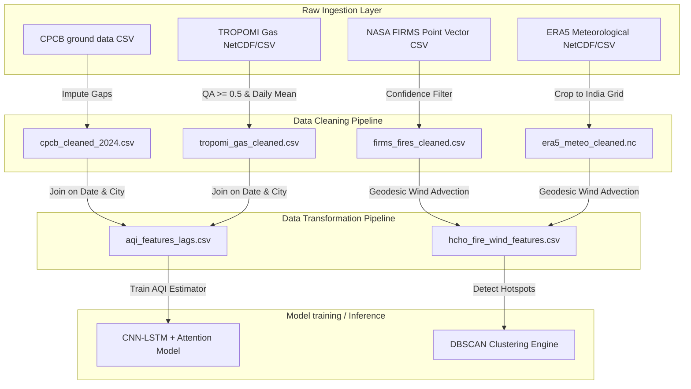

# Spatio-Temporal Data Fusion Strategy & Processing Pipeline

This reference document outlines the core scientific challenge, design architecture, and programmatic workflow of the **SSRO** project. It explains how our pipeline fuses ground-level observations and satellite-generated columns to solve key monitoring limitations.

---

## 1. The Core Scientific Challenge

In-situ ground monitoring stations (CPCB CAAQMS) measure surface criteria pollutants (PM2.5, PM10, NOx, CO, SO2, O3) but **do not monitor Formaldehyde (HCHO)**. Conversely, Sentinel-5P TROPOMI provides vertical column densities of HCHO but cannot measure the breathing zone concentration directly and suffers from cloud-path blockage and advection drift.

To solve this, we implement a **Spatio-Temporal Data Fusion** approach:

```
  +-----------------------+      +--------------------------+
  |    Ground Sensors     |      |    Satellite Columns     |
  |  (CPCB In-Situ AQI)   |      |   (TROPOMI HCHO/CO/NO2)  |
  |  * Direct Surface Chemistry  |      |   * Spatial Coverage     |
  |  * High Temporal Rate |      |   * Gap-prone (Swaths)   |
  +-----------+-----------+      +------------+-------------+
              |                               |
              +---------------+---------------+
                              |
                              v
                  [ Unified Data Fusion ]
                              |
                              v
             * Ground-level calibration of columns
             * Multi-sensor source fingerprinting
```

---

## 2. Ingestion & Alignment Architecture

Our pipelines standardise, clean, and merge distinct sensors using **Spatio-Temporal coordinates (Latitude, Longitude, Date)** as the primary relational keys:



---

## 3. Cross-Sensor Source Fingerprinting

To validate satellite-detected HCHO column enhancements without ground-level HCHO sensors, our cleaning pipeline correlates HCHO with **co-emitted surface species** measured at CPCB ground stations:

### Fingerprinting Signatures
1. **Agricultural Biomass Burning:**
   $$\uparrow \text{TROPOMI HCHO} \quad + \quad \uparrow \text{CPCB CO}_{\text{surface}} \quad + \quad \uparrow \text{NASA FIRMS FRP}$$
   * *Rationale:* Crops residue burning releases massive amounts of CO and volatile organic compounds (VOCs) that oxidize into HCHO.
2. **Industrial/Urban Emissions:**
   $$\uparrow \text{TROPOMI HCHO} \quad + \quad \uparrow \text{CPCB NO2}_{\text{surface}} \quad + \quad \text{Low/Zero Fire FRP}$$
   * *Rationale:* Industrial solvents, vehicular emissions, and chemical manufacturing release VOCs and high NOx, but lack the thermal anomalies of active open fires.

---

## 4. Boundary Layer Meteorological Coupling

Formaldehyde has a short atmospheric lifetime ($2-4\text{ hours}$ in daylight) and drifts downwind from fire sources. We link satellite columns with ground advection using a **Wind advection Plume Score**:

$$\text{Plume Score}_h = \sum_{f} \text{FRP}_f \times \exp\left(-\frac{d_{f, h}}{\lambda}\right) \times \cos^2(\theta_{f, h} - \phi_{\text{wind}})$$

Where:
* $d_{f, h}$: Geodesic distance between active fire $f$ and target grid cell $h$.
* $\lambda = 50\text{ km}$: Spatial decay constant representing VOC chemical aging and physical dispersion limits.
* $\theta_{f, h}$: Spatial bearing angle from the fire point to the target grid cell.
* $\phi_{\text{wind}}$: Boundary-layer wind advection direction derived from ERA5 10m $u$ and $v$ wind vector components:
  $$\phi_{\text{wind}} = \operatorname{atan2}(u, v) \pm 180^\circ$$

*A cell receives a high plume score only if it is downwind of active, high-intensity fires.*

---

## 5. Spatio-Temporal Lag Feature Generation

For ground AQI estimation across unmonitored grids, we engineer temporal sequence history to represent the accumulation of pollutants. The transformation pipeline builds sliding lags:

$$\mathbf{X}(t) = \left[ \mathbf{x}(t), \mathbf{x}(t-1), \mathbf{x}(t-2), \mathbf{x}(t-3) \right]$$

For variables:
* In-situ ground values: `CPCB_AQI`, `CPCB_PM25`, `CPCB_PM10`
* Satellite columns: `TROPOMI_HCHO`, `TROPOMI_NO2`, `TROPOMI_CO`
* Meteorology: `temp_c`, `wind_speed_ms`

This lag structure captures the temporal inertia of air masses (e.g. yesterday's local emissions still affecting today's AQI under low wind speeds).
